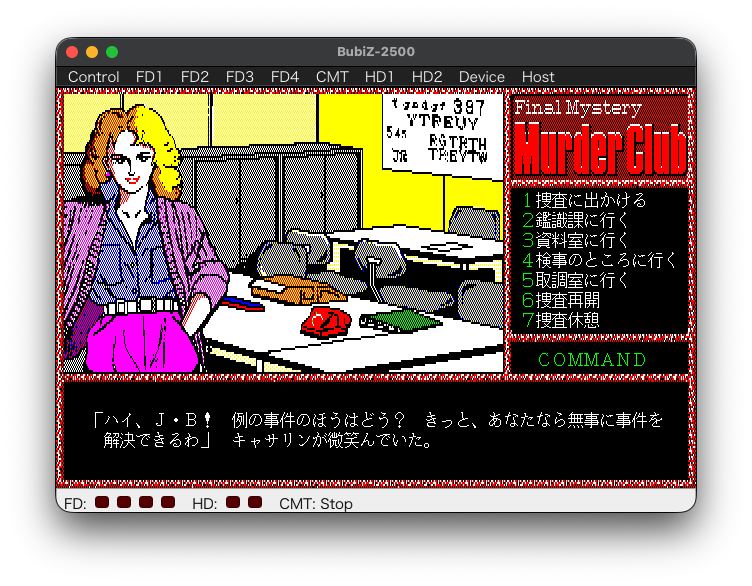

# BubiZ-2500

<p align="center">
  
</p>

BubiZ-2500 は、シャープ MZ-2500 のエミュレーターです。macOS / Linux / Windows で動作します。

<p align="center">
  <a href="https://github.com/bubio/BubiZ-2500/releases/latest">
    
  </a>
  <a href="https://github.com/bubio/BubiZ-2500/blob/main/LICENSE">
    
  </a>
  <a href="https://github.com/bubio/BubiZ-2500/releases/latest">
    
  </a>
</p>

エミュレーションコアには [Common Source Code Project](https://github.com/bubio/common_source_code_project) の EmuZ-2500 を利用し、アプリケーション部分は Odin、画面・音声・入力は Sokol で構成しています。操作感は、オリジナルの EmuZ-2500 に近づけることを目指しています。

<p align="center"></p>

## 主な機能

- **オリジナルに近いメニュー操作:** Control / FD1〜FD4 / CMT / HD1〜HD2 / Device / Host の各メニューと、ステータスバーを備えています。
- **ディスク・テープ・ハードディスク:** D88 などのフロッピーイメージ、CMT、HDD の挿入・取り出し、空のイメージの作成、最近使ったファイルの履歴に対応します。
- **ステート:** 保存したスロットの日時とサムネイルを一覧で確認しながら、保存・復元できます。
- **画面:** ウィンドウの拡大率、フルスクリーン、640x400 / 640x480 の縦横比、画面フィルタ(RGB)を選べます。
- **サウンド:** FM 音源を含むサウンド、音量ミキサー、WAV での録音に対応します。FDD やテープのノイズ音も再現します。
- **スクリーンショット:** PNG で保存します。
- **デバッガー:** 別ウィンドウのコンソール、またはアプリ内の画面で使えます。
- **CLI:** QUASI88 に準じた書式のコマンドラインオプションを備えています。

## ダウンロード

[**Releases**](https://github.com/bubio/BubiZ-2500/releases/latest) から入手できます。ファイル名は `BubiZ-2500-<バージョン>-<プラットフォーム>-<アーキテクチャ>` の形式です。

| プラットフォーム | 形式 | アーキテクチャ |
|------------------|------|----------------|
| Windows 11 以上 | `.zip` | `x64` |
| macOS 14 以上 | `.dmg` | `intel` / `apple-silicon` |
| Linux (Debian / Ubuntu 22.04 以上) | `.deb` | `amd64` / `arm64` |
| Linux (Fedora / RHEL / openSUSE) | `.rpm` | `x86_64` / `aarch64` |
| Linux (どのディストリビューションでも) | `.AppImage` | `x86_64` / `aarch64` |

> macOS 版は署名・公証をしていません。初回の起動は、Finder でアプリを右クリックして「開く」を選んでください。

## 事前に必要なもの

起動には、MZ-2500 の BIOS ROM が必要です。BubiZ-2500 には ROM を含めていません。お手持ちの実機から吸い出したファイルを、次のフォルダに置いてください。

- `IPL.ROM`
- `KANJI.ROM`
- `DICT.ROM`
- `PHONE.ROM`(音声合成を使う場合)
- `EMM.ROM`(EMM の初期内容を使う場合)

### データフォルダの場所

BIOS ROM、設定ファイル、ステートは、次のフォルダに置きます。`-romdir` オプションで変更できます。

| OS | 場所 |
|----|------|
| Linux | `~/.local/share/BubiZ-2500` |
| macOS | `~/Library/Application Support/BubiZ-2500` |
| Windows | `%APPDATA%\BubiZ-2500` |

スクリーンショットは「ピクチャ」、録音は「ミュージック」の下の `BubiZ-2500` フォルダに保存されます。

> ROM ファイルや市販ソフトのイメージを使うには、正当な権利を持っている必要があります。

## 使い方

メニューからディスクイメージを選ぶか、ウィンドウにファイルをドラッグ&ドロップします。コマンドラインからも起動できます。

```
BubiZ-2500 disk.d88
```

コマンドラインオプション、ホットキー、設定ファイルなどの詳細は、[使い方](docs/usage.md) を参照してください。

## ライセンス

- BubiZ-2500 は [GNU General Public License v2](LICENSE) で提供します。
- エミュレーションコアは、Common Source Code Project の EmuZ-2500 です。ライセンスの詳細は `core/csp/license` を参照してください。

---

*このプロジェクトは有志によるものであり、シャープ株式会社および Common Source Code Project の作者とは関係ありません。*
